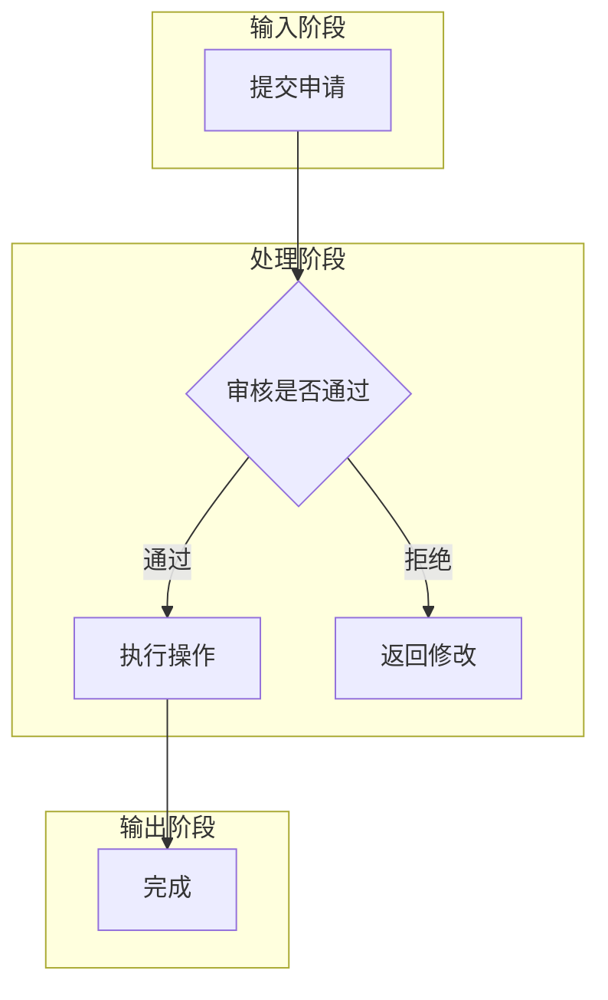
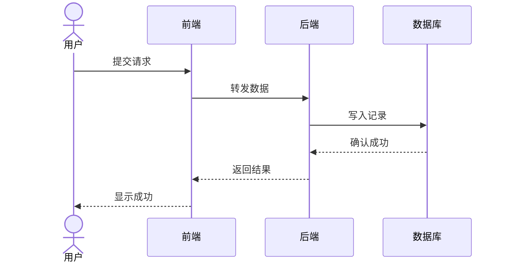
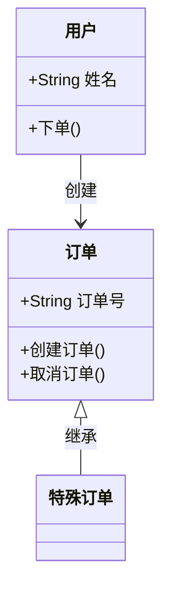
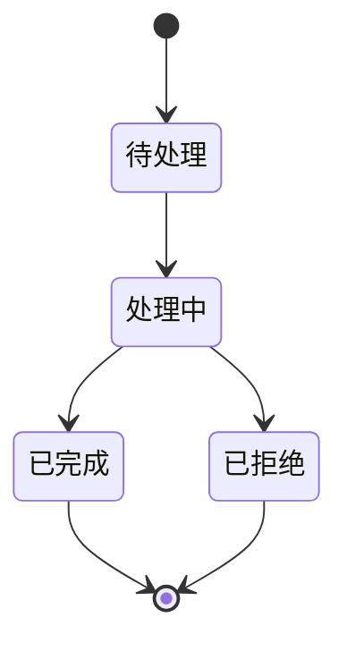
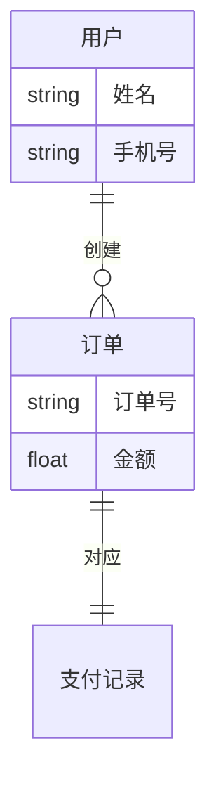

# Mermaid 图表规则 — Diagram Selection & Generation Rules

## 一、图表类型选择

根据场景内容的**核心特征**自动选择最合适的图表类型：

| 优先级 | 图表类型 | 语法关键字 | 适用场景 | 关键词信号 |
|--------|----------|-----------|---------|-----------|
| 1 | `sequenceDiagram` | `sequenceDiagram` | API 交互、系统间通信、多方协作、时序性强的消息传递、联锁逻辑多条件验证 | 多系统、接口、调用、通知、验证、联锁、MA更新、位置报告 |
| 2 | `stateDiagram-v2` | `stateDiagram-v2` | 状态机、生命周期、审批流程、状态流转 | 状态、流转、审批、生命周期、待处理、已完成 |
| 3 | `erDiagram` | `erDiagram` | 数据库设计、实体关系、数据表结构 | 实体、表、关联、一对多、数据模型 |
| 4 | `classDiagram` | `classDiagram` | 系统架构、类关系、模块依赖、面向对象设计 | 类、模块、接口、继承、系统架构 |
| 5 | `requirementDiagram` | `requirementDiagram` | 安全苛求系统需求追溯、FR/NFR/系统元素关系 | SIL、安全追溯、需求追溯、铁路信号安全领域 |
| 6 | `flowchart` | `flowchart TD` | 业务流程、工作流、决策树、用户操作路径 | 步骤、流程、决策、分支、用户操作 |

### 选择优先级（从高到低）

```
多方交互 / 系统侧条件验证 / 联锁逻辑 → sequenceDiagram
状态流转 / 审批 / 生命周期           → stateDiagram-v2
数据实体 / 表结构                    → erDiagram
类/模块/接口/继承                    → classDiagram
安全领域需求追溯（FR数量多）         → requirementDiagram
纯步骤流程                          → flowchart（默认）
```

### 特殊规则

- **铁路信号领域**：涉及多系统条件验证（联锁逻辑/安全条件检查→操作执行→结果反馈）时，`sequenceDiagram` 优先级高于 `flowchart`
- **CBTC/TACS 领域**：交互密集场景（MA更新/位置报告/门联锁/折返）自动触发 `sequenceDiagram`
- **安全苛求系统**：需求数量较多需追溯时，可选 `requirementDiagram`，但需注意小模型（<3B）输出此类型可能不稳定，建议配合大模型使用

---

## 二、Mermaid 生成规则（严格遵循）

1. **所有标签和描述使用中文**
2. **节点命名使用固定格式** `[动词+名词]`（如 `提交订单`、`确认支付`、`生成报告`），同一概念在全图中复用相同命名
3. **流程图结构固定顺序**：输入步骤 → 核心处理 → 分支决策 → 输出/终止
4. **用 `%%` 注释说明复杂逻辑**
5. **决策菱形 `{}` 最多 3 个分支**，每个分支用 `-->|标签|` 标注
6. **用 `subgraph` 按阶段分组**：输入阶段 / 处理阶段 / 输出阶段

---

## 三、各图表类型语法速查

### flowchart



### sequenceDiagram



### classDiagram



### stateDiagram-v2



### erDiagram



### requirementDiagram

```mermaid
requirementDiagram
    requirement FR1 {
        id: FR-1
        text: "用户登录认证"
        risk: High
        verifymethod: Test
    }
    requirement FR2 {
        id: FR-2
        text: "订单管理"
        risk: Medium
        verifymethod: Test
    }
    element 系统 {
        type: "system"
    }
    系统 - satisfies -> FR1
    系统 - satisfies -> FR2
```

---

## 四、质量要求

- Mermaid 代码必须是**可渲染的**，避免语法错误（如未闭合的括号、非法字符）
- 节点 ID 使用英文/拼音，显示文本使用中文：`A[提交订单]` 而非 `提交订单[提交订单]`
- 避免在节点文本中使用特殊字符 `{}[]()"`，必要时转义或简化
- 图表应**完整表达核心流程**，而非只画 2–3 个节点应付

---

## 五、Fallback 降级图表

当主 Mermaid 代码渲染失败时，按 `diagramType` 生成最简可渲染图表：

| diagramType | Fallback 代码 |
|-------------|---------------|
| `flowchart` | `flowchart TD\n  A[系统名称] --> B[待分析]` |
| `sequenceDiagram` | `sequenceDiagram\n  actor 用户\n  participant 系统\n  用户->>系统: 请求\n  系统-->>用户: 响应` |
| `classDiagram` | `classDiagram\n  class 系统 {\n    +操作()\n  }` |
| `stateDiagram-v2` | `stateDiagram-v2\n  [*] --> 初始\n  初始 --> [*]` |
| `erDiagram` | `erDiagram\n  实体 ||--o{ 子实体 : 包含` |
| `requirementDiagram` | `requirementDiagram\n    functionalRequirement mainReq {\n        id: FR-0\n        text: "系统名称"\n        risk: High\n        verifymethod: Test\n    }` |
